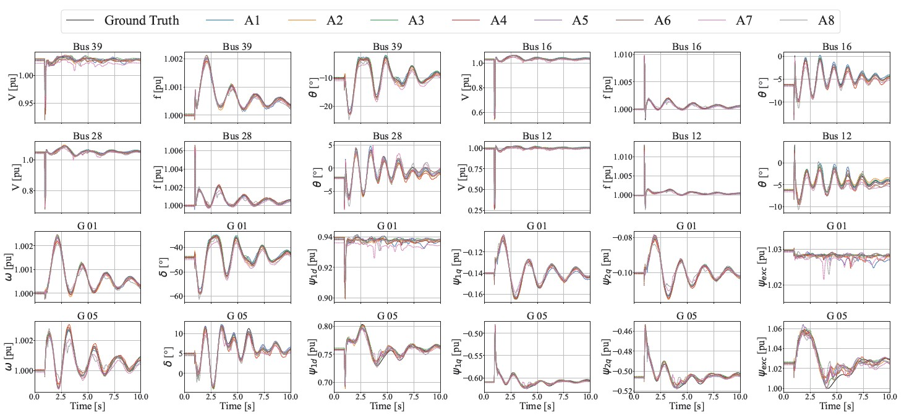
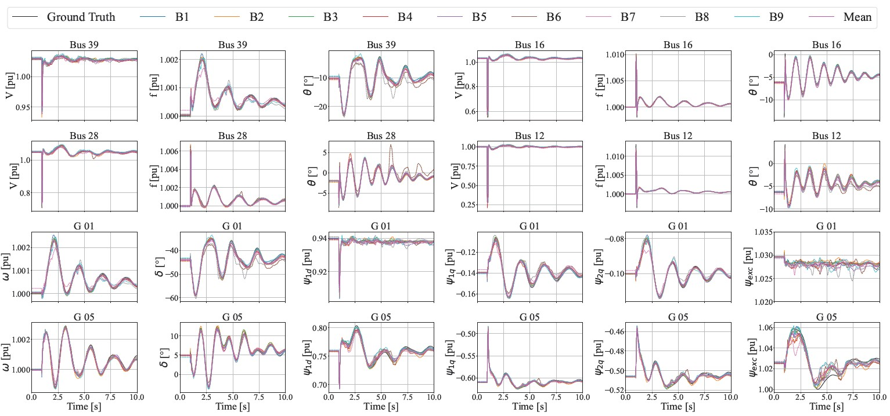

# ⚡ SHallow REcurrent Decoder for Dynamic State Estimation of Power Systems
This repository provides an implementation of the SHallow REcurrent Decoder (SHRED) for dynamic state estimation in power systems.

# 📄 Related publications
This repository collects the codes regarding the application of the Shallow REcurrent Decoder (SHRED) method to Power System. It serves as complementary code to the following papers:
- "A Shallow Recurrent Decoder for Dynamic State Estimation with a Limited Number of PMUs in Power Systems" by A. Pomarico, A. Berizzi, and J. Nathan Kutz, preprint, 2026

# 📊 Results

## Sensitivity analysis with respect to the number of PMUs: 
**TABLE I: Case studies with different numbers of PMUs**

| Case study | PMU deployment |
|------------|----------------|
| A1 | PMUs installed at all 39 buses |
| A2 | PMUs installed at the 30 buses with the highest Scc |
| A3 | PMUs installed at the 20 buses with the highest Scc |
| A4 | PMUs installed at the 10 buses with the highest Scc |
| A5 | PMUs installed at the 5 buses with the highest Scc |
| A6 | PMUs installed at the 3 buses with the highest Scc |
| A7 | PMUs installed at the 2 buses with the highest Scc |
| A8 | PMU installed at the bus with the highest Scc |

## Sensitivity analysis with respect to the location of PMUs: 
**TABLE II: Clusters with different PMU placement**

| Cluster | Bus with installed a PMU |
|--------|--------------------------|
| B1 | 01, 04, 08, 11, 12, 16, 18, 19, 20, 25 |
| B2 | 02, 03, 05, 09, 13, 14, 22, 23, 27, 28 |
| B3 | 06, 07, 10, 15, 17, 21, 24, 26, 29, 39 |
| B4 | 01, 12, 13, 14, 16 |
| B5 | 02, 09, 11, 18, 28 |
| B6 | 08, 19, 20, 24, 39 |
| B7 | 05, 07, 10, 17, 27 |
| B8 | 03, 04, 22, 23, 29 |
| B9 | 06, 15, 21, 25, 26 |

