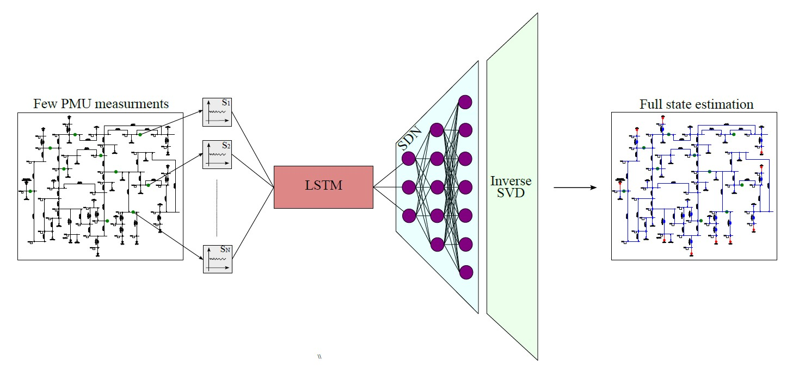

# ⚡ SHallow REcurrent Decoder for Dynamic State Estimation of Power Systems
This repository provides an implementation of the SHallow REcurrent Decoder (SHRED) for dynamic state estimation in power systems.

# 📄 Related publications
This repository collects the codes regarding the application of the Shallow REcurrent Decoder (SHRED) method to Power System. It serves as complementary code to the following papers:
- "A Shallow Recurrent Decoder for Dynamic State Estimation with a Limited Number of PMUs in Power Systems" by A. Pomarico, A. Berizzi, and J. Nathan Kutz, preprint, 2026

# 📊 Results

## TABLE I  
**Sensitivity analysis with respect to the number of PMUs: Case studies with different numbers of PMUs**

| Case study | PMU deployment |
|------------|----------------|
| A1 | PMUs installed at all 39 buses |
| A2 | PMUs installed at the 30 buses with the highest Scc |
| A3 | PMUs installed at the 20 buses with the highest Scc |
| A4 | PMUs installed at the 10 buses with the highest Scc |
| A5 | PMUs installed at the 5 buses with the highest Scc |
| A6 | PMUs installed at the 3 buses with the highest Scc |
| A7 | PMUs installed at the 2 buses with the highest Scc |
| A8 | PMU installed at the bus with the highest Scc |

